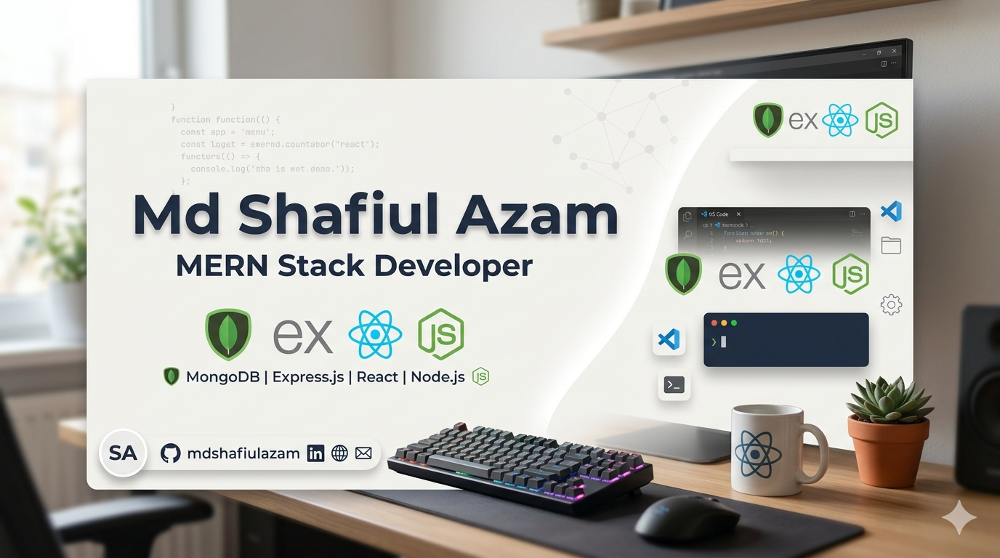
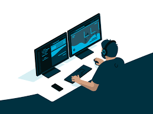

  

Hi there 👋, I'm Md Shafiul Azam

I'm a Full-Stack Developer from Bangladesh with experience building modern web applications using Typescript, React, Next.js, Node.js, Express.js, MongoDB, and PostgreSQL. I enjoy creating clean, scalable, and user-friendly solutions while continuously expanding my knowledge of web technologies and software development.

  <table width="100%">
    <tr>
      <td width="60%" valign="top">
<h2>Current Activities</h2>
<ul>
  <li>Building <strong>HireLoop</strong>, a full-stack job portal application.</li>
  <li>Working with <strong>Next.js, HeroUI, Express.js, and MongoDB</strong>.</li>
  <li>Creating small projects using <strong>TypeScript</strong> and <strong>PostgreSQL</strong> to expand my full-stack expertise.</li>
  <li>Implementing authentication, authorization, and RESTful APIs.</li>
  <li>Continuously enhancing my full-stack development skills.</li>
</ul>
<td width="40%" align="center">
  

    

</td>
    </tr>
  </table>

<h2>My Skills</h2>

  
  
  
  
  
  
  
  
  
  

<!-- Social Links Section -->
<h2>Connect with me</h2>

  

  

  

